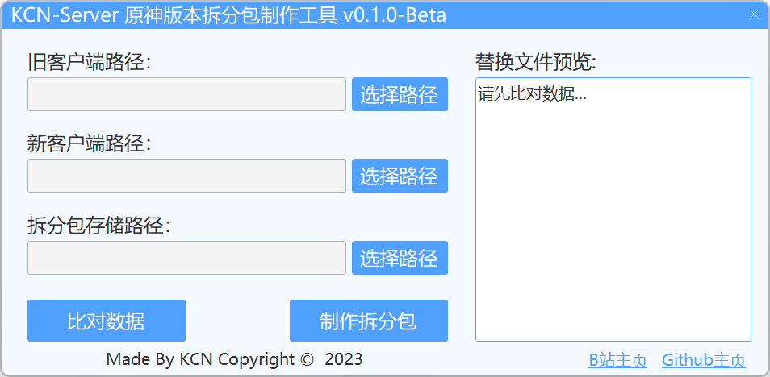

# KCN-GenshinPackagingTools

> 一个原神版本拆分包制作工具。

---

### 关于软件
- 软件还不完善，就多谢大家debug&提issues了！也欢迎小伙伴提交pr贡献代码~

### 软件下载
- 开箱即用

请到最新 [Releases](https://github.com/JDDKCN/KCN-GenshinPackagingTools/releases/) 处下载。

- 自行编译

请下载 [项目源码](https://codeload.github.com/JDDKCN/KCN-GenshinPackagingTools/zip/refs/heads/main.zip) 自行编译，需要VS环境。

### 软件截图
- v0.1.0-Beta 2023/09/24

### 更新日志
- v0.1.0-Beta 2023/09/24
  1. 发布了程序。

### 使用说明
  1. 选择旧版本原神路径
  2. 选择新版本原神路径
  3. 选择zip拆分包保存路径
  4. 您可以先比对数据，再输出拆分包，或直接制作拆分包。

### 系统支持
| 系统           | 可用性    | 系统         | 可用性    |
|---------------|----------|--------------|----------|
| Windows 11    | 支持     | Windows XP   | 不支持    |
| Windows 10    | 支持     | Mac OS       | 不支持    |
| Windows 7 - 8 | 支持   | Linux        | 不支持    |

### 免责声明
- 本程序是原神版本拆分包制作工具，使用A-GPLv3协议进行开源。项目仅供研究交流用，禁止用于商业及非法用途。使用本软件造成的事故与损失，与作者无关。本程序完全免费，如果您是花钱买的，说明您被骗了。请尽快退款，以减少您的损失。

### 联系方式
- [前往我的B站首页](https://space.bilibili.com/475547854/)
- [前往我的Twitter账号](https://twitter.com/2233KCN)
